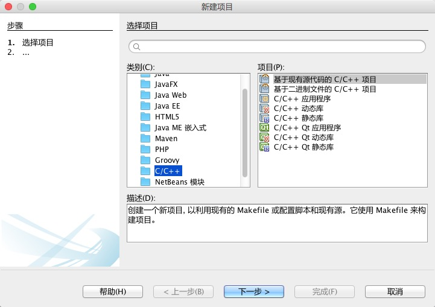

## 如何来实现一个完整的 PHP 扩展

在编写我们的扩展之前，我们先来下载一个现成的扩展试试看能不能编译通过。我们就以 xxtea 扩展为例吧。这里我们采用的安装方法不是：

```
pecl install xxtea
```

尽管这是 pecl 扩展的标准安装方式。但我们的目的并不是安装使用它，而是通过它来了解一下如何编写自己的扩展。所以我们使用源码方式来安装：


```
git clone https://github.com/xxtea/xxtea-pecl
cd xxtea-pecl
phpize
./configure
make
make test
```

如果这个过程中没有出现任何错误，那么说明你的开发环境已经配置好了。

### 扩展的基本骨架

如果你是通过源码编译方式安装的 PHP，并且还保留了你安装时的 PHP 源码。那么你在源码的 ext 目录下可以找到一个叫 ext_skel 的程序。它的功能正如它的名字，就是用来生成一个扩展的基本骨架的。

例如，假设我们还没有开始写 xxtea 这个扩展，并且我们已经在 PHP 源码的 ext 目录下了，下面我们执行：

```
./ext_skel --extname=xxtea
```

我们会看到这样的输出内容：

```
Creating directory xxtea
Creating basic files: config.m4 config.w32 .svnignore xxtea.c php_xxtea.h CREDITS EXPERIMENTAL tests/001.phpt xxtea.php [done].

To use your new extension, you will have to execute the following steps:

1.  $ cd ..
2.  $ vi ext/xxtea/config.m4
3.  $ ./buildconf
4.  $ ./configure --[with|enable]-xxtea
5.  $ make
6.  $ ./php -f ext/xxtea/xxtea.php
7.  $ vi ext/xxtea/xxtea.c
8.  $ make

Repeat steps 3-6 until you are satisfied with ext/xxtea/config.m4 and
step 6 confirms that your module is compiled into PHP. Then, start writing
code and repeat the last two steps as often as necessary.
```

通过这些信息，我们可以了解到，它帮我们在 ext 目录下，创建了一个 xxtea 的目录，并且在其中创建了一堆文件，这些文件就是一个 PHP 扩展的基本骨架。再后面它给出了一个编辑扩展的基本步骤，大致上呢，就这么多东西。

关于 ext_skel 以及它生成 config.m4 和 config.w32 这两个文件的介绍，读者可以参考官方的 [PHP 手册 — PHP 核心：骇客指南 — PHP 5 构建系统](http://php.net/manual/zh/internals2.buildsys.php)，其它几个文件介绍参见：[PHP 手册 — PHP 核心：骇客指南 — 扩展的结构](http://php.net/manual/zh/internals2.structure.php)，我这里就不重复了。

虽然上面说了这么多关于 ext_skel 的内容，但在实际开发扩展时，我们可能压根就不需要 ext_skel 这个程序。

为什么不需要 ext_skel 呢？首先一个原因是，它生成的这个骨架太过简单，在这个骨架的基础上修改又比较麻烦，还不如找一个现成的扩展，复制一份，修改一下来的方便。第二个原因是，不同版本的 PHP 生成的这个扩展骨架还是不一样的，如果你要编写的是跨版本的扩展，用这个东西也不太合适。它生成的东西，除了文件名以外，大部分东西你可能是需要重写的。

所以，即使你没有保留源码也无所谓，你不是通过编译源码方式安装的 PHP 也无所谓。只要本小节之前的那个测试过程能够完全通过，就可以进行开发了。

当然这只是我个人的看法，如果你觉得这个小工具能够帮到你的忙，那么你尽管用就可以了，不用在乎我的看法。

### 导入到 Netbeans

下面，我们忽略上一节所讲的所有内容。接下来的内容是紧接上一节之前的内容的。

要编辑扩展中的每个文件，用 vi 当然没问题，但对我这个懒人来说，用 Netbeans 更顺手一些。所以这里介绍一下如何把下载的扩展源文件导入到 Netbeans 中去。

导入其实很简单，打开 Netbeans 的菜单，选择 [文件] > [新建项目]，然后选择类别为 C/C++，项目为基于现有源代码的 C/C++ 项目，如图所示：


